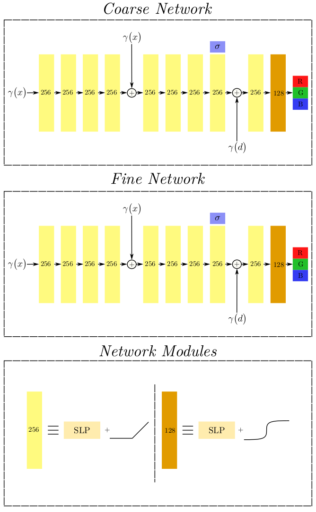

## nerf_implementation

This repository corresponds to a custom impementation of the [neural radiance fields](https://arxiv.org/abs/2003.08934).



In orded to install the proper dependencies after cloning the repository, 
run the following commands to create the `nerf` environment.

```
conda env create -f environment.yaml
conda activate nerf
```

To train the nerf network for the givel `lego_dataset` run 

```
python run_nerf.puy --conf conf/nerf_config.yaml
```

To evaluate the trained model qualitatively run 

```
python reconstruction.py --conf conf/nerf_config.yaml --model_path checkpoints/<model_path> --render_path <render_path> 
```

For 3D reconstruction you can extract colorless meshes through
that utilizes [marching cubes](https://github.com/pmneila/PyMCubes)
implemented by [pmneila](https://github.com/pmneila)
```
python reconstruction.py --model_path checkpoints/<model_path>  
```

In order to save you some time, we provide a pretrained model 
for the `lego_dataset` scene as `checkpoints/exalted-bush-58.4900.pth`
trained for 4900 iterations. Thus, you have only to provide our given 
checkpoint as the `--model_path` argument and you are ready to go.

